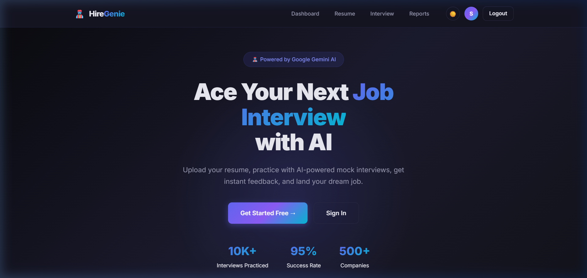
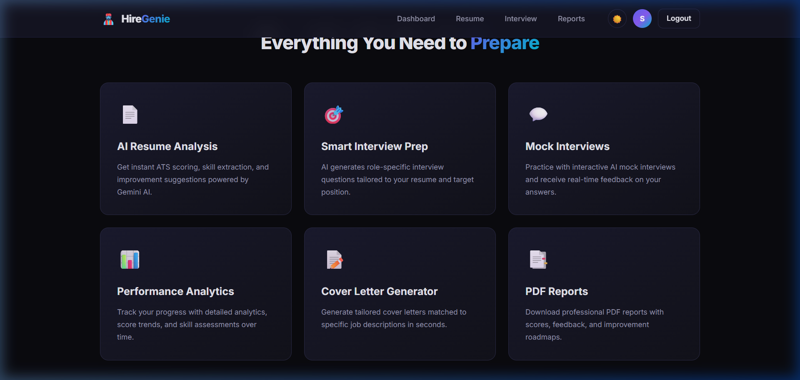
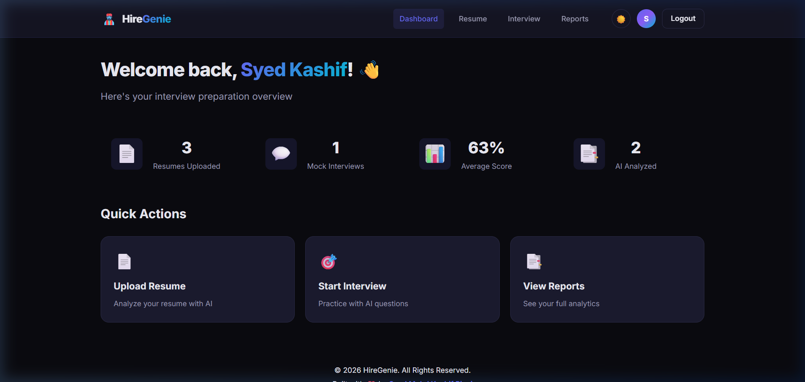
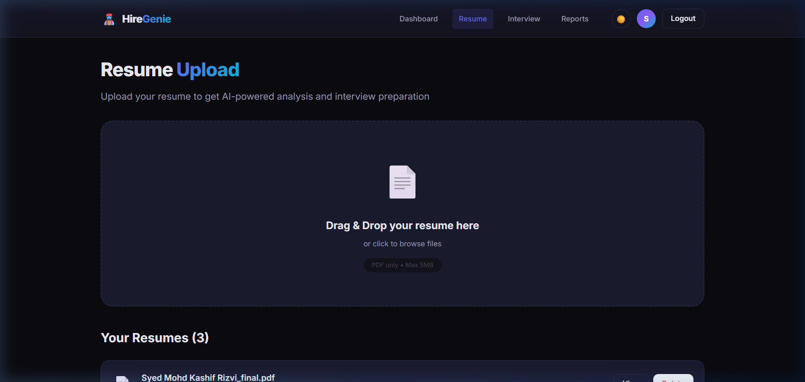
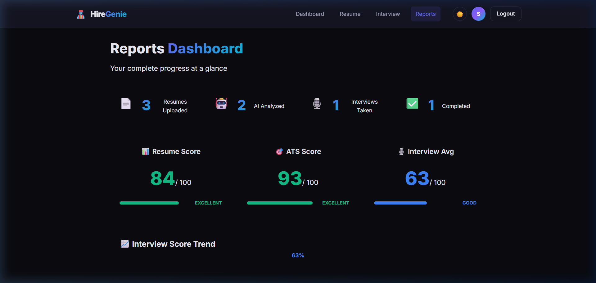
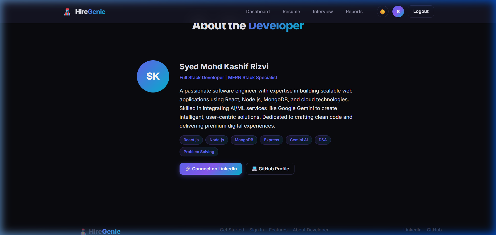

# 🧞‍♂️ HireGenie — AI-Powered Interview Preparation Platform

> Upload your resume, practice with AI mock interviews, get instant feedback, and land your dream job.


---

## 📸 Screenshots

### 🏠 Landing Page


### ✨ Features


### 📊 Dashboard (Live Stats)


### 📄 Resume Upload & AI Analysis


### 📈 Reports Dashboard


### 👨‍💻 About the Developer


---

## ✨ Features

| Feature | Description |
|---------|-------------|
| 📄 **AI Resume Analysis** | Upload PDFs and get ATS scoring, skill extraction & improvement suggestions |
| 🎯 **Smart Interview Prep** | AI generates role-specific questions tailored to your resume |
| 💬 **Mock Interviews** | Practice with interactive AI interviews and get real-time feedback |
| 📊 **Reports Dashboard** | Track progress with analytics, score trends & skill assessments |
| 🔐 **JWT Authentication** | Secure login/register with token-based auth |
| 🌗 **Dark/Light Theme** | Toggle between dark and light modes |

---

## 🛠️ Tech Stack

### Frontend
- React 19 + Vite
- React Router v7
- Axios for API calls
- React Hot Toast (notifications)
- Custom CSS Design System

### Backend
- Node.js + Express.js
- MongoDB + Mongoose
- Google Gemini AI (2.0 Flash)
- JWT Authentication
- Multer (file uploads)
- pdf-parse (PDF text extraction)

---

## 📁 Project Structure

```
hiregenie/
├── client/                     # ⚛️ React Frontend
│   ├── public/                 # Static assets
│   ├── src/
│   │   ├── components/
│   │   │   ├── common/         # ProtectedRoute
│   │   │   ├── layout/         # Navbar, Footer
│   │   │   └── ui/             # UI primitives
│   │   ├── context/            # React Context (Auth, Theme)
│   │   ├── hooks/              # Custom hooks
│   │   ├── pages/              # Page components
│   │   ├── services/           # API service layer
│   │   ├── styles/             # CSS design system
│   │   └── utils/              # Utility functions
│   ├── index.html
│   ├── vite.config.js
│   └── package.json
│
├── server/                     # 🟢 Express Backend
│   ├── config/                 # DB & AI configuration
│   ├── controllers/            # Route handlers
│   ├── middleware/              # Auth, error handling, rate limiting
│   ├── models/                 # Mongoose schemas
│   ├── routes/                 # API route definitions
│   ├── services/               # Business logic (AI, interview)
│   ├── uploads/                # Uploaded resume files
│   ├── utils/                  # Helpers & validators
│   ├── server.js               # Express entry point
│   └── package.json
│
├── screenshots/                # 📸 App screenshots
├── .gitignore
└── README.md
```

---

## 🚀 Getting Started

### Prerequisites
- Node.js >= 18
- MongoDB Atlas account
- Google Gemini API key

### 1. Clone the repo
```bash
git clone https://github.com/Kashif7180/hiregenie.git
cd hiregenie
```

### 2. Setup Server
```bash
cd server
npm install
cp .env.example .env
# Edit .env with your credentials
npm run server
```

### 3. Setup Client
```bash
cd client
npm install
npm run dev
```

### 4. Open in browser
```
http://localhost:5173
```

---

## ⚙️ Environment Variables

Create a `.env` file in the `/server` directory:

```env
PORT=5000
NODE_ENV=development
MONGODB_URI=your_mongodb_connection_string
JWT_SECRET=your_jwt_secret
JWT_EXPIRE=7d
GEMINI_API_KEY=your_gemini_api_key
CLIENT_URL=http://localhost:5173
```

---

## 📡 API Endpoints

| Method | Endpoint | Description |
|--------|----------|-------------|
| POST | `/api/auth/register` | Register new user |
| POST | `/api/auth/login` | Login user |
| GET | `/api/auth/me` | Get current user |
| POST | `/api/resume/upload` | Upload resume PDF |
| POST | `/api/resume/:id/analyze` | AI analyze resume |
| GET | `/api/resume` | List all resumes |
| POST | `/api/interview/start` | Start mock interview |
| POST | `/api/interview/:id/answer/:qId` | Submit answer |
| GET | `/api/interview` | List all interviews |
| GET | `/api/report/dashboard` | Get dashboard report |

---

## 👨‍💻 Developer

**Syed Mohd Kashif Rizvi**  
Full Stack Developer | MERN Stack Specialist

[](https://linkedin.com/in/syed-mohd-kashif-rizvi-83549)
[](https://github.com/Kashif7180)

---

## 📄 License

© 2026 HireGenie. All Rights Reserved.  
Built with ❤️ by **Syed Mohd Kashif Rizvi**.
